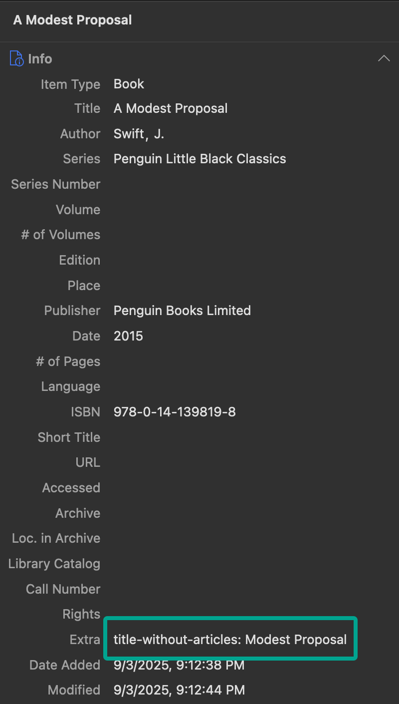
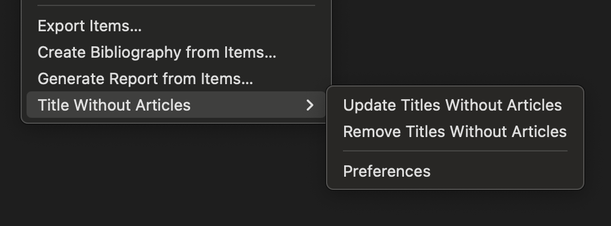

# Zotero Title Without Articles

[](https://www.zotero.org)

A Zotero plugin that automatically generates sort titles without leading articles (a, an, the, etc.) for proper bibliography sorting.

## Features

- Automatically generates sort titles without leading articles
- Customizable list of articles to remove
- Works with Zotero 7
- Smart field management - only adds field when needed

## Installation

1. Download the latest `.xpi` file from the [Releases](https://github.com/boan-anbo/zotero-title-without-articles/releases) page
2. In Zotero, go to Tools → Add-ons
3. Click the gear icon and select "Install Add-on From File..."
4. Select the downloaded `.xpi` file

## How It Works

This plugin leverages [Zotero's Extra field](https://www.zotero.org/support/kb/item_types_and_fields#citing_fields_from_extra) to store a `title-without-articles` CSL variable. The Extra field allows you to add custom CSL variables that aren't natively supported in Zotero, making them accessible to citation styles. When the plugin adds `title-without-articles: Modest Proposal` to the Extra field, any CSL style can access this value using `<text variable="title-without-articles"/>`.

### Example: "A Modest Proposal" becomes "Modest Proposal"



### `title-without-articles` Field Management Rules

**New Items (with the plugin installed):** Automatically receive the `title-without-articles` field when created, if their title starts with an article.

**Existing Items:** The plugin respects your choices:

- Items with the field: Automatically updated when title changes
- Items without the field: Only updated via right-click menu → "Update Titles Without Articles"
- Manual removal: Delete the field from Extra to prevent future auto-updates for that item

### Right-Click Menu Options



**Smart Behavior:**

- If a title doesn't start with an article, no field is added (keeps your Extra field clean)
- If you edit a title to remove its leading article, the field is automatically removed
- Changes to your article list automatically update all items that have the field

### Using in Citation Styles ([CSL](https://docs.citationstyles.org/en/stable/specification.html))

To enable article-free sorting in any CSL style, add a wrapper [macro](https://docs.citationstyles.org/en/stable/specification.html#macro) and replace the title sort key. This approach preserves all your style's special title handling (legal cases, bills, etc.) while adding article-free sorting when the field is available.

**Example:** Modified Chicago Manual of Style 18th edition (author-date) with article-free sorting: [`assets/chicago-18-author-date-no-articles.csl`](assets/chicago-18-author-date-no-articles.csl)  
**Original style:** <https://www.zotero.org/styles/chicago-author-date>

### CSL Modification: Before and After

**Before ([Original Chicago 18th CSL](https://www.zotero.org/styles/chicago-author-date)):**

```xml
<bibliography et-al-min="7" et-al-use-first="3" hanging-indent="true">
  <sort>
    <key macro="author-sort"/>
    <key macro="date-sort-group"/>
    <key macro="date-sort-year"/>
    <key macro="date"/>
    <key macro="title-and-descriptions-bib"/> <!-- Original title sorting -->
    <key macro="source-bib"/>
    <key variable="volume"/>
    <key variable="part-number"/>
    <key variable="event-date"/>
    <key variable="issued"/>
    <key macro="source-archive-bib"/>
  </sort>
</bibliography>
```

**After (Modified CSL with article-free sorting):**

```xml
<!-- Macro for sorting with title-without-articles when available -->
<macro name="title-sort-without-articles">
  <choose>
    <if variable="title-without-articles">
      <text variable="title-without-articles"/>
    </if>
    <else>
      <!-- Fallback to the standard title sorting logic when the item doesn't have a title-without-articles -->
      <text macro="title-and-descriptions-bib"/>
    </else>
  </choose>
</macro>

<!-- Then modify the bibliography sort section -->
<bibliography et-al-min="7" et-al-use-first="3" hanging-indent="true">
  <sort>
    <key macro="author-sort"/>
    <key macro="date-sort-group"/>
    <key macro="date-sort-year"/>
    <key macro="date"/>
    <key macro="title-sort-without-articles"/> <!-- Replaced title-and-descriptions-bib -->
    <key macro="source-bib"/>
    <key variable="volume"/>
    <key variable="part-number"/>
    <key variable="event-date"/>
    <key variable="issued"/>
    <key macro="source-archive-bib"/>
  </sort>
</bibliography>
```

## Configuration

You can customize the list of leading articles to remove in the plugin preferences:

1. Preferences → General → "Title Without Articles" _or_ Right-click select "Preferences" under "Title Without Articles"
2. Modify the list of articles as needed (default: `a, an, the`)
   - Add articles from any language: `el, la, le, der, die, das`
   - Or any leading words you want to ignore for sorting: `on, in, at`

Note: Only words at the **beginning** of titles are removed. "The Great Gatsby" becomes "Great Gatsby", but "Journey to the West" remains unchanged.

## License

This project is licensed under the AGPL-3.0 License - see the [LICENSE](LICENSE) file for details.

## References

- [Citation Style Language (CSL) Specification](https://docs.citationstyles.org/en/stable/specification.html)
- [CSL Macro Documentation](https://docs.citationstyles.org/en/stable/specification.html#macro)
- [Zotero Extra Field - Citing Fields from Extra](https://www.zotero.org/support/kb/item_types_and_fields#citing_fields_from_extra)
- [Chicago Manual of Style 18th edition (author-date) - Original](https://www.zotero.org/styles/chicago-author-date)
